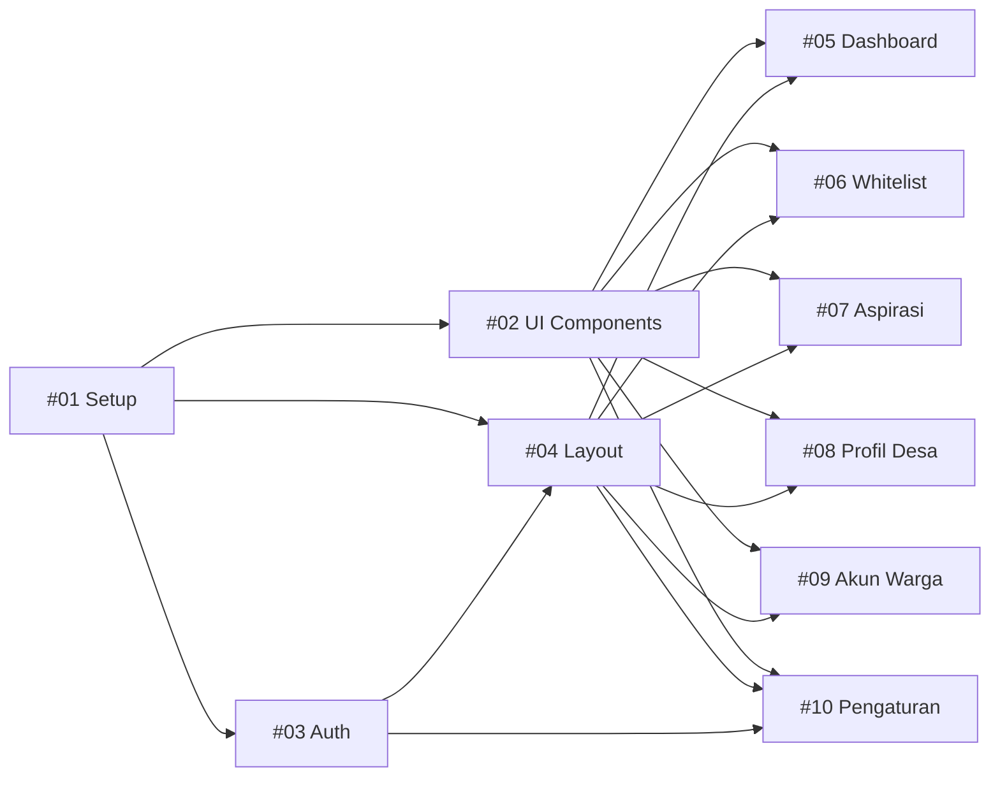

# 📋 ASPIRA AI — Issue Tracker

> Daftar issue untuk migrasi ASPIRA AI ke Next.js
> Berdasarkan [PRD.md](file:///C:/Users/Hype/.gemini/antigravity/brain/a7ba2187-9f9f-42d4-b2f8-618221c3d9f1/PRD.md)

---

## Fase 1 — Fondasi ⚙️

| # | Issue | Prioritas | Estimasi | Status |
|---|---|---|---|---|
| 01 | [Project Setup & Fondasi](file:///C:/Users/Hype/.gemini/antigravity/brain/a7ba2187-9f9f-42d4-b2f8-618221c3d9f1/issues/issue-01-project-setup.md) | 🔴 Critical | 3-4 jam | ⬜ Todo |
| 02 | [Komponen UI Reusable](file:///C:/Users/Hype/.gemini/antigravity/brain/a7ba2187-9f9f-42d4-b2f8-618221c3d9f1/issues/issue-02-reusable-ui-components.md) | 🔴 Critical | 4-5 jam | ⬜ Todo |

## Fase 2 — Layout & Navigasi 🧭

| # | Issue | Prioritas | Estimasi | Status |
|---|---|---|---|---|
| 03 | [Sistem Autentikasi & Login](file:///C:/Users/Hype/.gemini/antigravity/brain/a7ba2187-9f9f-42d4-b2f8-618221c3d9f1/issues/issue-03-auth-system.md) | 🔴 Critical | 4-5 jam | ⬜ Todo |
| 04 | [Admin Layout & Sidebar](file:///C:/Users/Hype/.gemini/antigravity/brain/a7ba2187-9f9f-42d4-b2f8-618221c3d9f1/issues/issue-04-layout-sidebar.md) | 🔴 Critical | 3-4 jam | ⬜ Todo |

## Fase 3 — Migrasi Halaman 📄

| # | Issue | Prioritas | Estimasi | Status |
|---|---|---|---|---|
| 05 | [Dashboard Desa](file:///C:/Users/Hype/.gemini/antigravity/brain/a7ba2187-9f9f-42d4-b2f8-618221c3d9f1/issues/issue-05-dashboard.md) | 🟠 High | 3-4 jam | ⬜ Todo |
| 06 | [Whitelist Warga](file:///C:/Users/Hype/.gemini/antigravity/brain/a7ba2187-9f9f-42d4-b2f8-618221c3d9f1/issues/issue-06-whitelist-warga.md) | 🟠 High | 4-5 jam | ⬜ Todo |
| 07 | [Aspirasi Warga](file:///C:/Users/Hype/.gemini/antigravity/brain/a7ba2187-9f9f-42d4-b2f8-618221c3d9f1/issues/issue-07-aspirasi-warga.md) | 🟠 High | 5-6 jam | ⬜ Todo |
| 08 | [Profil Desa & UMKM](file:///C:/Users/Hype/.gemini/antigravity/brain/a7ba2187-9f9f-42d4-b2f8-618221c3d9f1/issues/issue-08-profil-desa-umkm.md) | 🟠 High | 5-6 jam | ⬜ Todo |
| 09 | [Akun Warga](file:///C:/Users/Hype/.gemini/antigravity/brain/a7ba2187-9f9f-42d4-b2f8-618221c3d9f1/issues/issue-09-akun-warga.md) | 🟠 High | 4-5 jam | ⬜ Todo |
| 10 | [Pengaturan](file:///C:/Users/Hype/.gemini/antigravity/brain/a7ba2187-9f9f-42d4-b2f8-618221c3d9f1/issues/issue-10-pengaturan.md) | 🟡 Medium | 4-5 jam | ⬜ Todo |

---

## Dependency Graph

## Total Estimasi

| Fase | Jam |
|---|---|
| Fase 1 — Fondasi | 7-9 jam |
| Fase 2 — Layout | 7-9 jam |
| Fase 3 — Halaman | 25-31 jam |
| **Total** | **39-49 jam** |

## Urutan Pengerjaan yang Disarankan

1. `#01` → `#02` → `#03` → `#04` (pondasi wajib selesai dulu)
2. `#05` Dashboard (halaman paling sederhana, cocok untuk validasi arsitektur)
3. `#06` Whitelist (CRUD pertama, memvalidasi pattern Modal + Form)
4. `#09` Akun Warga (mirip Whitelist, memperkuat pattern)
5. `#08` Profil Desa (kompleksitas menengah: chart + CRUD + export)
6. `#07` Aspirasi (paling kompleks: 2-column layout + audio + PDF)
7. `#10` Pengaturan (terakhir, karena paling independen)
